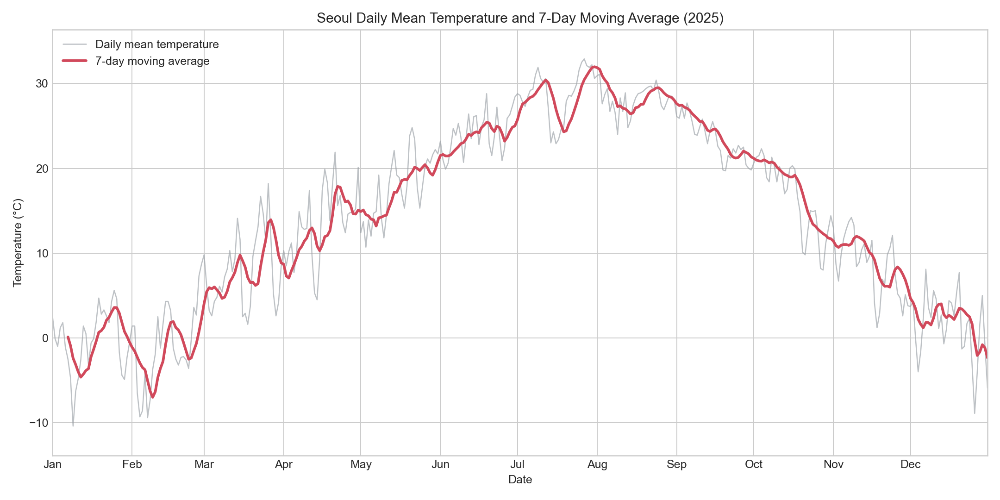
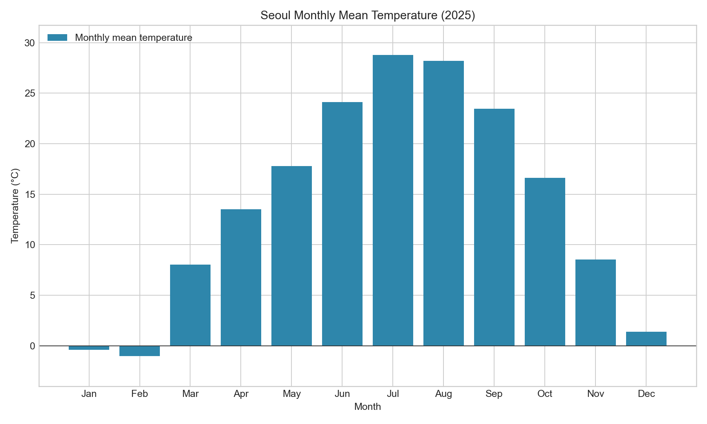
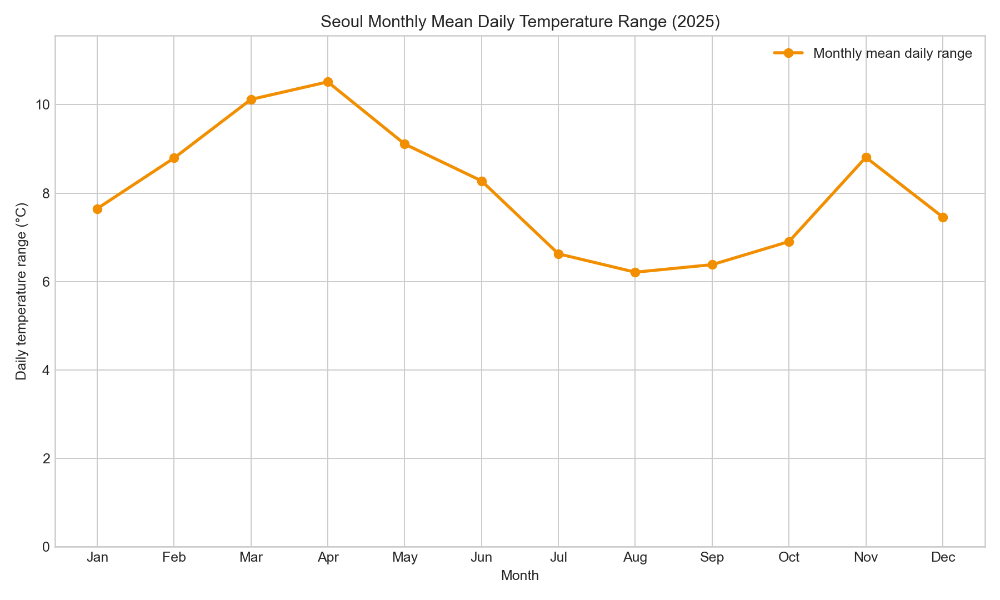

# 2025년 서울 일별 기온 변화와 계절별 특징 분석

## 1. 분석 주제 및 선정 이유

서울의 2025년 일별 기온 데이터를 분석해 연간 기온 추세와 계절별 특징을 확인한다.
완료된 1개 연도의 일별 데이터를 사용하므로 100개 이상의 데이터 포인트와 사계절을 모두 포함할 수 있다.

## 2. 분석 질문

1. 2025년 서울의 일평균기온과 7일 이동평균은 시간에 따라 어떻게 변했는가?
2. 일 최고기온이 가장 높았던 날과 일 최저기온이 가장 낮았던 날은 언제이며, 각각 몇 도였는가?
3. 월별 평균기온과 월별 평균 일교차에는 어떤 차이가 있는가?
4. 전일 대비 평균기온 변화량이 컸던 시기는 언제이며, 상승과 하락 폭은 각각 얼마였는가?

## 3. 데이터 설명

- 분석 기간: 2025-01-01 – 2025-12-31
- 분석 지역: 서울
- 데이터 배포 기관: Meteostat
- 데이터 종류: 관측소별 일자료 CSV
- 관측 지점: 서울(관측소 ID 및 WMO 번호 47108, 위도 37.5667, 경도 126.9667)
- 데이터 출처: [Meteostat 일자료 다운로드 설명](https://dev.meteostat.net/data/timeseries/daily)
- 원본 파일: `data/seoul_47108_2025_daily.csv`
- 데이터 수: 365행
- 주요 컬럼: `year`, `month`, `day`, `temp`(평균기온), `tmin`(최저기온), `tmax`(최고기온)
- 기온 단위: 섭씨(°C)
- 라이선스: [Creative Commons Attribution 4.0](https://creativecommons.org/licenses/by/4.0/)
- 주의사항: 일자료에는 관측값뿐 아니라 결측 관측값을 대체한 모델 자료가 포함될 수 있으며, 각 기온 컬럼의 `_source` 컬럼에서 원자료 출처를 확인할 수 있다.

## 4. 데이터 정제

### 정제 기준

- 날짜: `year`, `month`, `day`를 결합해 날짜 자료형의 `date` 컬럼을 생성하고 오름차순으로 정렬했다.
- 필수 컬럼 결측치: `date`, `temp`, `tmin`, `tmax` 중 하나라도 비어 있으면 분석에서 제외하기로 했다.
- 중복: 같은 날짜가 반복되면 첫 행만 유지하고, 값이 충돌하는 경우 원본을 다시 확인하기로 했다.
- 논리 이상치: `최저기온 ≤ 평균기온 ≤ 최고기온`을 만족하지 않는 행은 제외하기로 했다.
- 현실 범위 이상치: 단위·입력 오류를 점검하기 위한 보수적 기준으로 기온이 -30°C 미만 또는 45°C를 초과하는 행을 제외하기로 했다.
- 분석에 사용하지 않는 강수량(`prcp`)과 적설량(`snwd`)의 결측치는 임의로 채우지 않고 원본 그대로 유지했다.

### 확인 및 처리 결과

- 처리 전 데이터: 365행
- 필수 컬럼 결측 행: 0개
- 중복 날짜 및 중복 행: 0개
- 기온 논리 이상 행: 0개
- 현실 범위 이상 행: 0개
- 실제 범위: 평균기온 -10.4°C에서 32.9°C, 최저기온 -12.2°C에서 29.4°C, 최고기온 -6.0°C에서 37.6°C
- 처리 후 데이터: 365행

기온 분석에 필요한 행에는 제거하거나 대체할 값이 없었다. 따라서 원본 365행을 모두 분석에 사용한다. 강수량과 적설량은 이번 분석 대상이 아니므로 해당 컬럼의 결측치는 분석 결과에 영향을 주지 않는다.

## 5. 분석 방법

### 적용한 분석 기법

1. **7일 이동평균:** 당일을 포함한 최근 7일의 평균기온을 계산했다. 하루 단위의 불규칙한 흔들림을 줄이고 완만한 기온 흐름을 확인하기 위해 사용했다. 첫 6일은 7일치 데이터가 없으므로 이동평균을 계산하지 않았다.
2. **월별 평균기온:** 일평균기온을 월 단위로 평균 내어 계절에 따른 기온 수준을 비교했다. 일별 데이터만 보면 알아보기 어려운 월별 차이를 요약하기 위해 사용했다.
3. **일교차:** `최고기온 - 최저기온`으로 계산했다. 하루 안에서 기온이 얼마나 크게 달라졌는지 확인하기 위한 지표이다.
4. **전일 대비 변화량:** `당일 평균기온 - 전일 평균기온`으로 계산했다. 양수는 상승, 음수는 하락을 뜻하며 갑작스러운 기온 변화를 찾는 데 사용했다. 첫날은 비교할 전날이 없어 계산하지 않았다.

### 트렌드·계절성·노이즈의 의미

- **트렌드:** 장기간에 걸쳐 나타나는 전반적인 상승·하락 흐름이다. 이 분석에서는 일별 변동을 완화한 7일 이동평균으로 확인한다.
- **계절성:** 계절이나 월처럼 일정한 주기에 따라 나타나는 변화이다. 서울 기온이 겨울에 낮고 여름에 높아지는 연중 변화는 월별 평균으로 확인한다. 다만 한 해만 분석하므로 여러 해에 반복되는 계절성을 증명할 수는 없다.
- **노이즈:** 장기 흐름과 계절적 패턴만으로 설명하기 어려운 불규칙한 일별 변동이다. 기상 변화에 따른 자연스러운 흔들림일 수 있으므로 오류와 같은 의미로 해석하지 않는다.

### 계산 결과 요약

- 7일 이동평균: 359개
- 일교차: 365개
- 전일 대비 평균기온 변화량: 364개
- 최고기온이 가장 높은 날: 2025-07-27, 37.6°C
- 최저기온이 가장 낮은 날: 2025-01-10, -12.2°C
- 전일 대비 평균기온이 가장 크게 상승한 날: 2025-04-16, +8.1°C
- 전일 대비 평균기온이 가장 크게 하락한 날: 2025-03-16, -9.1°C

| 월 | 평균기온(°C) | 평균 일교차(°C) |
| ---: | ---: | ---: |
| 1 | -0.39 | 7.65 |
| 2 | -1.03 | 8.79 |
| 3 | 8.03 | 10.12 |
| 4 | 13.50 | 10.52 |
| 5 | 17.77 | 9.11 |
| 6 | 24.12 | 8.28 |
| 7 | 28.76 | 6.63 |
| 8 | 28.20 | 6.21 |
| 9 | 23.47 | 6.38 |
| 10 | 16.60 | 6.90 |
| 11 | 8.52 | 8.81 |
| 12 | 1.37 | 7.46 |

## 6. 시각화 및 분석 결과

### 시각화 단위 선택 기준

- **일 단위:** 원본의 세부 변화를 유지해 갑작스러운 기온 변화를 확인하기 위해 사용했다.
- **7일 이동평균:** 일별 노이즈를 줄이면서 주 단위의 완만한 흐름을 확인하기 위해 사용했다.
- **월 단위:** 365개의 일별 값을 12개 구간으로 요약해 계절에 따른 평균기온과 일교차 차이를 쉽게 비교하기 위해 사용했다.

### 그래프 1. 일평균기온과 7일 이동평균

회색 선은 일평균기온, 붉은 선은 7일 이동평균이다. 일평균기온은 1월 9일 -10.4°C로 가장 낮았고 7월 27일 32.9°C로 가장 높았다. 날짜 축은 2025년 1월부터 12월까지 오름차순으로 표시했다. 실제 데이터 범위에 여백을 더한 Y축을 사용해 일별 변화와 연중 흐름이 모두 보이도록 했다.

### 그래프 2. 월별 평균기온

월별 평균기온은 2월 -1.03°C에서 7월 28.76°C까지 변한다. 0°C 기준선을 표시하고 데이터 최솟값과 최댓값에 여백을 둬 막대 길이가 과장되거나 잘리지 않도록 했다.

### 그래프 3. 월별 평균 일교차

월별 평균 일교차는 4월 10.52°C로 가장 크고 8월 6.21°C로 가장 작다. Y축을 0°C부터 시작해 월별 차이가 실제보다 과장되어 보이지 않도록 했다.

## 7. 인사이트

### 인사이트 1. 월평균기온은 겨울에서 여름까지 상승한 뒤 다시 하락했다

- **관찰(Fact):** 월평균기온은 2월 -1.03°C에서 7월 28.76°C까지 29.79°C 상승했다. 이후 8월 28.20°C, 9월 23.47°C, 12월 1.37°C로 낮아졌다. 일평균기온의 7일 이동평균도 여름까지 상승하고 겨울로 갈수록 하락하는 흐름을 보였다.
- **해석(Why):** 이는 서울의 일반적인 사계절 변화와 비슷한 패턴으로 해석할 수 있다. 그러나 2025년 한 해의 자료만으로 평년보다 더웠는지 또는 장기적인 기후변화가 나타났는지는 판단할 수 없다.
- **행동(Action):** 최근 10년 이상의 같은 관측소 자료와 평년값을 추가해 월별 편차와 장기 추세를 비교한다.

### 인사이트 2. 봄철에 전일 대비 기온이 크게 바뀐 날이 있었다

- **관찰(Fact):** 전일 대비 일평균기온이 가장 크게 상승한 날은 4월 16일로 +8.1°C였고, 가장 크게 하락한 날은 3월 16일로 -9.1°C였다. 가장 큰 하락 폭의 절댓값이 가장 큰 상승 폭보다 1.0°C 컸다.
- **해석(Why):** 두 변화는 계절이 바뀌는 시기의 기단 교체나 전선 통과와 관련되었을 가능성이 있다. 하지만 기온 데이터만으로 실제 원인을 확정할 수는 없다.
- **행동(Action):** 해당 날짜 전후의 기압, 풍향·풍속, 강수량과 일기도를 함께 확인해 급격한 변화의 원인 가설을 검증한다.

### 인사이트 3. 평균 일교차는 봄에 크고 한여름에 작았다

- **관찰(Fact):** 월별 평균 일교차는 4월 10.52°C로 가장 컸고 8월 6.21°C로 가장 작았다. 두 달의 차이는 4.31°C였다. 3월도 10.12°C로 큰 편이었으며, 7–9월은 각각 6.63°C, 6.21°C, 6.38°C로 비교적 작았다.
- **해석(Why):** 봄에는 건조하거나 맑은 날의 낮 가열과 야간 냉각이 상대적으로 컸고, 여름에는 습도와 구름이 일교차를 줄였을 가능성이 있다. 이 설명은 이번 기온 데이터만으로 확인된 원인이 아니라 추가 검증이 필요한 가설이다.
- **행동(Action):** 월별 습도, 운량, 강수일수와 일교차의 관계를 비교하고 상관분석을 수행한다.

## 8. 결론

2025년 서울의 일별 기온은 겨울에서 여름으로 갈수록 상승하고 이후 다시 낮아지는 뚜렷한 연중 흐름을 보였다. 월평균기온은 2월 -1.03°C로 가장 낮고 7월 28.76°C로 가장 높아 두 달 사이에 29.79°C 차이가 났다. 일 최고기온은 7월 27일 37.6°C, 일 최저기온은 1월 10일 -12.2°C였다.

7일 이동평균을 이용하자 불규칙한 일별 변동보다 계절에 따른 완만한 변화가 선명하게 나타났다. 한편 일평균기온은 3월 16일 전일 대비 9.1°C 하락하고 4월 16일에는 8.1°C 상승해, 전체적인 계절 흐름 안에서도 갑작스러운 변화가 발생했음을 확인했다. 월별 평균 일교차는 4월 10.52°C로 가장 크고 8월 6.21°C로 가장 작았다.

따라서 서울 기온을 이해할 때는 월별 평균과 같은 장기 흐름뿐 아니라 이동평균, 일교차, 전일 대비 변화량을 함께 살펴야 한다. 다만 이번 결과는 2025년의 패턴을 설명하며 장기적인 기후 추세나 원인까지 확정하는 결과는 아니다.

## 9. 한계점

- **단일 기간:** 2025년 한 해만 분석했으므로 여러 해에 반복되는 계절성, 평년 대비 이상 정도, 장기적인 기후변화를 판단할 수 없다.
- **단일 지역:** 서울 관측소 1곳의 자료만 사용했기 때문에 서울 내부의 지역별 차이나 다른 도시의 기온 특성을 대표하지 못한다.
- **변수 범위:** 분석에는 주로 평균·최고·최저기온만 사용했다. 습도, 운량, 강수, 풍향·풍속, 기압 등 기온 변화와 관련될 수 있는 외부 변수를 함께 분석하지 않았다.
- **인과관계:** 전선 통과, 기단 교체, 습도와 구름 등의 설명은 가능한 가설이며 이번 분석만으로 실제 원인이라고 확정할 수 없다.
- **자료 특성:** Meteostat 일자료에는 결측 관측값을 대신한 모델 자료가 포함될 수 있다. `_source` 컬럼으로 출처를 확인할 수 있지만 관측값과 모델값의 차이를 별도로 비교하지 않았다.
- **일 단위 집계:** 일자료를 사용했기 때문에 하루 중 시간대별 급격한 기온 변화는 확인할 수 없다.

## 10. AI 사용 로그

### AI를 사용한 작업

- 과제 요구사항을 단계별 체크리스트로 정리
- pandas를 이용한 데이터 불러오기, 날짜 변환, 결측치·중복·이상치 확인 코드 작성
- 7일 이동평균, 월별 평균, 일교차, 전일 대비 변화량 계산 코드 작성
- Matplotlib 시각화 코드와 그래프 제목·축·범례 구성
- 계산 결과를 바탕으로 인사이트의 `관찰(Fact)`, `해석(Why)`, `행동(Action)` 구조 작성
- 리포트의 결론, 한계점 및 문장 표현 정리

### AI를 사용한 이유

- 과제 요구사항이 많아 누락되지 않도록 작업 순서를 빠르게 정리하기 위해 사용했다.
- 전처리와 시각화에 필요한 반복적인 Python 코드 작성 시간을 줄이기 위해 사용했다.
- 이동평균, 월별 집계, 일교차 등 분석 목적에 맞는 방법의 대안을 탐색하기 위해 사용했다.
- 오류 가능성이 있는 코드와 계산식을 여러 관점에서 검토하기 위해 사용했다.
- 관찰과 해석을 구분하고 리포트 문장을 이해하기 쉽게 다듬기 위해 사용했다.

### AI 결과의 검증 방법

- 원본 CSV의 행 수, 기간, 컬럼과 일부 값을 pandas 출력 결과와 비교했다.
- `python analysis.py`를 다시 실행해 전처리, 계산, 그래프 생성 과정이 오류 없이 재현되는지 확인했다.
- 월별 평균기온, 평균 일교차, 최대 상승·하락 값을 별도의 계산 명령으로 다시 계산해 리포트 수치와 대조했다.
- 생성된 그래프 3개를 직접 열어 제목, 축, 단위, 범례, 날짜 순서와 Y축 범위를 육안으로 확인했다.
- `REPORT.md`의 Markdown 이미지 경로가 실제 PNG 파일을 가리키는지 프로그램으로 확인했다.
- 과제 원문의 요구사항과 `CHECKLIST.md`를 대조해 필수 항목의 누락 여부를 확인했다.

### 최종 판단 및 해석 검증

AI가 제안한 해석은 그대로 결론으로 사용하지 않았다. 데이터에서 다시 계산한 2월 평균기온 -1.03°C, 7월 평균기온 28.76°C, 4월 평균 일교차 10.52°C, 8월 평균 일교차 6.21°C, 최대 상승 +8.1°C, 최대 하락 -9.1°C가 리포트와 일치하는 것을 확인했다. 또한 그래프에서 겨울에서 여름까지 상승한 뒤 다시 하락하는 흐름과 봄·여름의 일교차 차이를 직접 확인했다.

따라서 계산과 그래프에서 확인되는 내용은 **관찰(Fact)** 로 작성하고, 기단·전선·습도·구름과 관련된 설명은 추가 기상자료가 필요하므로 **해석(가설)** 로만 작성했다. 최종 결론은 검증된 수치와 그래프에 근거해 판단했다.

| 사용 작업 | 사용 이유 | 검증 방법 |
|---|---|---|
| 프로젝트 구조 및 초안 작성 | 작업 순서 정리와 시간 절감 | 과제 요구사항과 파일 구조를 직접 대조 |
