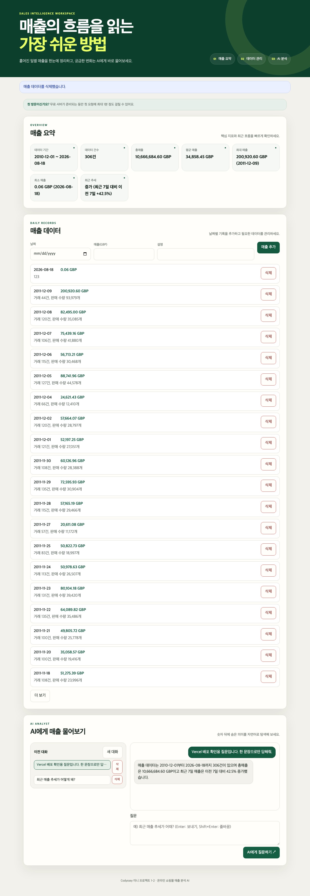
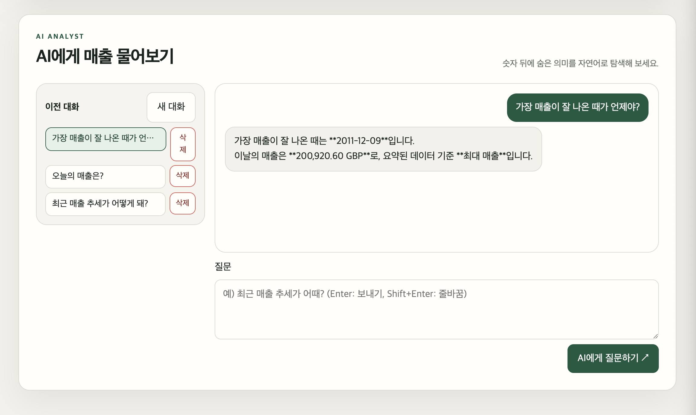

# 온라인 쇼핑몰 매출 분석 AI

영국 온라인 소매 거래 데이터를 일별 매출로 분석하고, 저장된 요약 정보를 바탕으로 질문에 답하는 AI 서비스입니다.

## 소개

온라인 쇼핑몰을 운영하다 보면 "요즘 매출이 늘고 있나?", "어느 날이 제일 잘 팔렸지?" 같은 질문에 답하려고 매번 거래 내역 전체를 열어 직접 훑어봐야 하는 불편이 있습니다. 이 서비스는 그 과정을 대신합니다.

- **매출 요약 화면**: 저장된 날짜별 매출의 기간·건수·총매출·평균·최대/최소·최근 추세(증가·감소·유지)를 한 화면에서 바로 보여줍니다.
- **매출 데이터 관리 화면**: 날짜별 매출을 추가·삭제하며 저장된 목록을 확인할 수 있습니다.
- **AI 채팅**: "최근 매출 추세가 어때?"처럼 자연어로 물으면, 실제 저장된 매출 요약을 근거로 한국어 답을 받습니다. 원본 거래 데이터를 직접 뒤지지 않아도 됩니다.

## 화면 스크린샷

배포된 화면([`https://codyssey-one.vercel.app`](https://codyssey-one.vercel.app))에서 실제로 캡처했습니다.

**매출 요약과 AI 채팅**



데이터 기간·건수·총매출·평균·최대/최소·최근 추세를 요약 카드로 보여주고, 그 아래 채팅에서 "최근 매출 추세가 어때?"라는 질문에 실제 저장된 매출(총매출 10,666,684.60 GBP, 최근 7일 대비 42.5% 증가)을 근거로 답합니다.

**이전 대화 목록과 재조회**



왼쪽 "이전 대화" 목록에서 과거 질문("가장 매출이 잘 나온 때가 언…", "오늘의 매출은?", "최근 매출 추세가 어떻게 돼?")을 선택하면, 오른쪽에 그 대화의 질문("가장 매출이 잘 나온 때가 언제야?")과 AI 답변("가장 매출이 잘 나온 때는 2011-12-09입니다. 이날의 매출은 200,920.60 GBP로, 요약된 데이터 기준 최대 매출입니다.")이 나눴던 순서 그대로 다시 나타납니다. 답변에 쓰인 날짜·금액도 실제 저장된 최댓값과 일치합니다.

## 빠른 시작

처음 이 프로젝트를 받은 사람이 자기 컴퓨터에서 실행하는 순서입니다. 각 항목의 자세한 내용은 아래 관련 절을 참고하세요.

1. [환경변수 목록](#환경변수-목록)을 참고해 `.env`를 준비합니다(`.env.example` 복사 후 값 채우기).
2. Python 3.10 이상에서 가상환경을 만들고 [`requirements.txt`](requirements.txt)를 설치합니다.
   ```bash
   python3 -m venv .venv
   source .venv/bin/activate
   pip install -r requirements.txt
   ```
3. [로컬 Firebase 연결](#로컬-firebase-연결) 절대로 서비스 계정을 준비하고 연결을 확인합니다.
4. (원본 데이터를 처음부터 다시 정리하려면) [데이터 전처리](#데이터-전처리) 절의 명령으로 `data/daily_sales.csv`를 만듭니다. 이미 있는 CSV를 그대로 쓰면 생략해도 됩니다.
5. [일별 매출 CSV Firestore 적재](#일별-매출-csv-firestore-적재) 절의 명령으로 Firestore에 매출 데이터를 넣습니다.
6. [AI 연동](#ai-연동코디세이-api-콘솔) 절을 참고해 코디세이 API 키를 설정합니다.
7. [백엔드 실행](#백엔드-실행)과 [프론트엔드 실행](#프론트엔드-실행) 절의 명령으로 두 서버를 각각 켭니다.
8. [자동 테스트](#자동-테스트)로 주요 기능이 정상인지 확인합니다.

## 기술 스택

- **백엔드**: Python 3.12, FastAPI, Uvicorn, Pydantic
- **데이터베이스**: Firebase Firestore (Firebase Admin SDK)
- **AI**: 코디세이 API 콘솔의 OpenAI 호환 엔드포인트, `openai` Python SDK, 모델 `gpt-5.4-mini`
- **프론트엔드**: HTML, CSS, 바닐라 JavaScript (별도 빌드 도구 없음)
- **테스트**: pytest, FastAPI `TestClient`
- **배포**: 백엔드 Render, 프론트엔드 Vercel

## 아키텍처

서버 코드는 역할별로 네 계층으로 나눕니다.

```text
routers/       요청을 받고 상태 코드를 정하는 부분 (FastAPI 엔드포인트)
services/      실제 계산·조합을 하는 부분 (요약 계산, AI 프롬프트, 채팅 흐름)
repositories/  Firestore 문서를 읽고 쓰는 부분
schemas/       요청·응답 데이터 모양 (Pydantic 모델)
```

라우터가 Firestore를 직접 호출하지 않고 저장소(repository)를 거치게 만든 이유는, 테스트할 때 진짜 Firestore 대신 가짜 저장소로 바꿔 끼울 수 있게 하기 위해서입니다. 실제로 `tests/` 아래 모든 테스트는 `app.dependency_overrides`로 저장소와 AI 클라이언트를 가짜로 교체해 실행하며, 비용이나 네트워크 없이도 통과합니다.

요청값은 Pydantic 모델(`backend/schemas/`)로 먼저 검사합니다. 예를 들어 매출 날짜가 실제 존재하는 날짜인지, 매출 금액이 0 이상인지, 질문이 비어 있지 않은지를 라우터 코드에 도달하기 전에 걸러냅니다. 잘못된 입력이 Firestore나 AI 호출까지 가면 디버깅이 어렵고 비용도 낭비되므로, 가능한 한 앞단에서 막습니다. 검증에 실패하면 서버는 항상 HTTP 422와 함께 같은 형식의 한국어 오류를 돌려줍니다.

## 학습 노트

- [Firebase 프로젝트와 Firestore 준비 (3-1~3-17)](docs/learning-note-stage-3-firestore.md)

## 데이터 출처

- 데이터셋: [UCI Machine Learning Repository — Online Retail](https://archive.ics.uci.edu/dataset/352/online+retail)
- 인용: Chen, D. (2015). *Online Retail* [Dataset]. UCI Machine Learning Repository.
- DOI: [10.24432/C5BW33](https://doi.org/10.24432/C5BW33)
- 라이선스: [CC BY 4.0](https://creativecommons.org/licenses/by/4.0/)
- 거래 기간: 2010-12-01 ~ 2011-12-09
- 규모: 541,909개 거래 행
- 업체 정보: 영국에 등록된 비점포 온라인 소매업체이며, 업체명은 공개되지 않았습니다.
- 고객 정보: 고객은 이름 대신 숫자형 `CustomerID`로 구분됩니다.

원본 파일은 `data/Online Retail.xlsx`에 로컬로 보관하며, 용량과 재배포 관리를 위해 Git 추적 대상에서 제외합니다.

### 확인한 원본 필드

| 필드 | 의미 |
| --- | --- |
| `InvoiceNo` | 거래 송장 번호 |
| `Description` | 상품 설명 |
| `Quantity` | 거래별 상품 수량 |
| `InvoiceDate` | 거래 생성 날짜와 시간 |
| `UnitPrice` | 상품 한 개당 가격(파운드) |
| `Country` | 고객 거주 국가 |

원본에는 위 필드 외에도 `StockCode`, `CustomerID`가 포함되어 있습니다.

## 데이터 전처리

다음 기준으로 원본 거래를 정제합니다.

1. `InvoiceNo`가 `C`로 시작하는 취소 거래를 제외합니다.
2. `Quantity`가 0 이하인 반품·비정상 거래를 제외합니다.
3. `UnitPrice`가 0 이하인 무료·비정상 거래를 제외합니다.
4. `InvoiceNo`, `Description`, `Quantity`, `InvoiceDate`, `UnitPrice`, `Country` 중 하나라도 비어 있는 행을 제외합니다.
5. 거래별 매출을 `Quantity × UnitPrice`로 계산하고 거래 날짜별로 합산합니다.
6. 날짜별 고유 송장 수와 판매 수량 합계를 `memo`에 기록합니다.

원본 파일은 수정하지 않으며 다음 명령으로 `data/daily_sales.csv`를 다시 만들 수 있습니다.

```bash
source .venv/bin/activate
python scripts/preprocess_sales.py
```

결과는 Firestore 적재에 사용할 `date`, `value`, `memo` 세 열로 구성됩니다. `value`는 영국 파운드(GBP) 기준이며 소수점 둘째 자리로 반올림합니다.

## Firestore 데이터 구조

Firebase 프로젝트 `codyssey-m1-2-e3344`의 `(default)` Firestore Database를 사용합니다. 데이터베이스는 Standard 버전, 프로덕션 모드이며 위치는 `asia-northeast3`(Seoul)입니다.

### `data` 컬렉션

하루의 매출 집계를 문서 한 건으로 저장합니다. 같은 날짜를 다시 적재해도 문서가 중복 생성되지 않도록 문서 ID는 `date`와 동일한 `YYYY-MM-DD` 형식을 사용합니다.

| 필드 | Firestore 타입 | 필수 | 의미 및 예시 |
| --- | --- | --- | --- |
| `date` | string | 예 | 집계 날짜, ISO 8601 `YYYY-MM-DD` 형식. 예: `2010-12-01` |
| `value` | number | 예 | 해당 날짜의 총매출(GBP), 0 이상의 숫자. 예: `58635.56` |
| `memo` | string | 예 | 거래 건수와 판매 수량 요약. 예: `거래 127건, 판매 수량 2,685개` |
| `created_at` | timestamp | 예 | 문서를 처음 생성한 서버 시각 |
| `updated_at` | timestamp | 예 | 문서를 마지막으로 수정한 서버 시각 |

```json
{
  "date": "2010-12-01",
  "value": 58635.56,
  "memo": "거래 127건, 판매 수량 2,685개",
  "created_at": "<server timestamp>",
  "updated_at": "<server timestamp>"
}
```

### `conversations` 컬렉션

AI 채팅 한 대화를 문서 한 건으로 저장하며 문서 ID는 Firestore 자동 ID를 사용합니다. `messages` 배열의 순서가 실제 대화 순서입니다.

| 필드 | Firestore 타입 | 필수 | 의미 및 예시 |
| --- | --- | --- | --- |
| `title` | string | 예 | 대화 목록에 표시할 제목. 첫 사용자 질문을 기준으로 생성 |
| `messages` | array&lt;map&gt; | 예 | 사용자와 AI 메시지를 시간순으로 저장한 배열 |
| `created_at` | timestamp | 예 | 대화를 처음 생성한 서버 시각 |
| `updated_at` | timestamp | 예 | 메시지를 마지막으로 추가하거나 대화를 수정한 서버 시각 |

`messages`의 각 원소는 다음 필드를 가집니다.

| 필드 | Firestore 타입 | 의미 |
| --- | --- | --- |
| `role` | string | 메시지 작성자. `user` 또는 `assistant`만 허용 |
| `content` | string | 사용자 질문 또는 AI 답변 |
| `created_at` | timestamp | 메시지를 생성한 서버 시각 |

```json
{
  "title": "최근 매출 추세가 어때?",
  "messages": [
    {
      "role": "user",
      "content": "최근 매출 추세가 어때?",
      "created_at": "<server timestamp>"
    },
    {
      "role": "assistant",
      "content": "최근 7일 평균을 이전 7일과 비교하면…",
      "created_at": "<server timestamp>"
    }
  ],
  "created_at": "<server timestamp>",
  "updated_at": "<server timestamp>"
}
```

타임스탬프는 클라이언트가 전달한 시간을 신뢰하지 않고 백엔드에서 Firestore 서버 시각으로 기록합니다. 실제 컬렉션과 문서는 초기 데이터 적재 및 API 호출 시 생성합니다.

## 일별 매출 CSV Firestore 적재

`data/daily_sales.csv`를 `data` 컬렉션에 배치로 적재합니다. 문서 ID를 `date`로 고정하므로 같은 명령을 다시 실행해도 문서가 중복되지 않고 값만 덮어씁니다.

```bash
source .venv/bin/activate
python -m scripts.load_sales_to_firestore
```

실행하면 읽은 건수와 저장 성공·실패 건수를 출력합니다. 적재 후 `GET /api/data`로 실제 저장 건수를 다시 확인할 수 있습니다.

## 로컬 Firebase 연결

서비스 계정 JSON은 프로젝트 밖에 보관하고 로컬 `.env`에는 파일 경로만 설정합니다. 실제 경로와 JSON 내용은 Git에 포함하지 않습니다.

```dotenv
FIREBASE_SERVICE_ACCOUNT_JSON=
FIREBASE_SERVICE_ACCOUNT_PATH=/absolute/path/to/firebase-service-account.json
```

환경을 준비하고 실제 Firestore 연결을 확인합니다.

```bash
source .venv/bin/activate
python -m scripts.check_firestore_connection
```

성공하면 `Firestore 연결에 성공했습니다.`가 출력됩니다. 초기화 코드는 `backend/core/firebase.py`, 환경변수 검증은 `backend/core/config.py`에 있습니다.

## AI 연동(코디세이 API 콘솔)

AI 답변은 OpenAI를 직접 호출하지 않고, 코디세이 API 콘솔이 제공하는 OpenAI 호환 엔드포인트(`https://copa.codyssey.kr/v1`)로 보냅니다. 콘솔에서 발급한 virtual key를 `OPENAI_API_KEY`에 설정하고, 모델은 `gpt-5.4-mini`를 기본값으로 사용합니다.

```dotenv
OPENAI_API_KEY=<코디세이 콘솔에서 발급한 virtual key>
OPENAI_BASE_URL=https://copa.codyssey.kr/v1
OPENAI_MODEL=gpt-5.4-mini
OPENAI_MAX_OUTPUT_TOKENS=500
OPENAI_TIMEOUT_SECONDS=20
```

`OPENAI_BASE_URL`과 `OPENAI_MODEL`을 비워 두면 위 기본값을 그대로 사용합니다. 매출 요약을 시스템 프롬프트로 바꾸는 코드는 `backend/services/ai_prompt.py`, 실제 호출과 오류 처리는 `backend/services/ai_client.py`에 있습니다.

개발·테스트에서는 실제 API를 호출하지 않고 정해진 답을 돌려주는 가짜 AI를 켤 수 있습니다. `ENVIRONMENT=production`이면 이 설정은 무시되고 항상 실제 AI를 호출합니다.

```dotenv
USE_MOCK_AI=true
ENVIRONMENT=development
```

`POST /api/chat` 하나가 처리되는 순서는 다음과 같습니다.

```text
사용자 질문
  → Firestore에서 매출 데이터 조회 및 요약 계산 (8단계 요약 로직 재사용)
  → 요약을 시스템 프롬프트에 넣기 (원본 거래 전체가 아니라 계산된 요약만 전달)
  → 코디세이 API(OpenAI 호환)에 질문 + 요약 전달
  → 사용자 질문과 AI 답변을 conversations 컬렉션에 자동 저장
  → AI 답변과 conversation_id를 화면에 반환
```

실제 OpenAI 호출에는 코디세이 콘솔의 토큰이 소모되어 비용이 생길 수 있습니다. 한 번에 너무 긴 답변이 나오지 않도록 `OPENAI_MAX_OUTPUT_TOKENS`로 최대 답변 길이를 제한하고 있으며, 개발 중에는 위의 `USE_MOCK_AI`로 비용 없이 채팅 흐름만 확인할 수 있습니다.

## 백엔드 실행

```bash
source .venv/bin/activate
uvicorn backend.main:app --reload
```

주요 주소는 다음과 같습니다.

- 상태 확인: `http://localhost:8000/health`
- API 진입점: `http://localhost:8000/api`
- Swagger UI: `http://localhost:8000/docs`
- OpenAPI JSON: `http://localhost:8000/openapi.json`

`ALLOWED_ORIGINS`에 등록된 화면 주소에서 온 요청만 브라우저가 허용합니다(CORS). 아무 웹사이트나 이 API를 가져다 쓰지 못하게 막는 최소한의 안전장치이며, `API_BASE_URL`처럼 환경마다 달라지는 값과 비밀 열쇠는 코드에 적지 않고 `.env`(로컬) 또는 배포 플랫폼의 환경변수(Render, Vercel)로만 전달합니다. 코드와 `.env`를 분리해 두면 실수로 비밀값을 커밋하는 사고를 줄일 수 있고, 같은 코드를 로컬·운영 환경에 값만 바꿔 재사용할 수 있습니다.

## 프론트엔드 실행

프론트엔드는 정적 파일이라 별도 빌드 없이 아무 정적 서버로 열면 됩니다.

```bash
cd frontend
python3 -m http.server 3000
```

브라우저에서 `http://localhost:3000`으로 접속합니다. `frontend/js/config.js`가 접속 주소를 보고 API 서버를 자동으로 고릅니다.

- `localhost`/`127.0.0.1`에서 열면 로컬 백엔드(`http://localhost:8000`)를 사용합니다.
- 그 외 주소(Vercel 배포 등)에서는 배포된 Render 주소를 사용합니다.
- 브라우저 콘솔에서 `localStorage.setItem('apiBaseUrl', '원하는 주소')`로 강제로 바꿀 수도 있습니다.

로컬 프론트엔드(`http://localhost:3000`)에서 배포된 Render 서버로 요청하려면, Render의 `ALLOWED_ORIGINS`에 `http://localhost:3000`이 포함되어 있어야 합니다(기본값에 이미 포함).

## 자동 테스트

```bash
pytest -q
```

실제 Firebase·OpenAI 없이 가짜 저장소와 가짜 AI로 백엔드 전체 기능(스키마 검증, 매출 CRUD, 요약 계산, 대화 CRUD, 채팅 흐름)을 확인합니다.

## 환경변수 목록

실행에 필요한 설정값입니다. 실제 값은 `.env.example`을 복사한 `.env`에만 넣고, Git에는 올리지 않습니다.

| 이름 | 필수 여부 | 의미 |
| --- | --- | --- |
| `OPENAI_API_KEY` | 필수(AI 사용 시) | 코디세이 콘솔에서 발급한 virtual key |
| `OPENAI_BASE_URL` | 선택 | 기본값 `https://copa.codyssey.kr/v1` |
| `OPENAI_MODEL` | 선택 | 기본값 `gpt-5.4-mini` |
| `OPENAI_MAX_OUTPUT_TOKENS` | 선택 | AI 답변 최대 길이(토큰), 기본값 500 |
| `OPENAI_TIMEOUT_SECONDS` | 선택 | AI 응답 대기 제한(초), 기본값 20 |
| `USE_MOCK_AI` | 선택 | `true`면 개발용 가짜 AI 사용 (운영 환경에서는 무시됨) |
| `ENVIRONMENT` | 선택 | `production`이면 `USE_MOCK_AI`를 무시하고 항상 실제 AI 호출 |
| `FIREBASE_SERVICE_ACCOUNT_JSON` | 필수(둘 중 하나) | Firebase 서비스 계정 JSON 문자열 |
| `FIREBASE_SERVICE_ACCOUNT_PATH` | 필수(둘 중 하나) | Firebase 서비스 계정 JSON 파일 경로 |
| `ALLOWED_ORIGINS` | 필수 | CORS를 허용할 프론트엔드 주소 목록(쉼표 구분) |
| `API_BASE_URL` | 참고용 | 프론트엔드 배포 시 참고하는 백엔드 주소 표기 |

`FIREBASE_SERVICE_ACCOUNT_JSON`과 `FIREBASE_SERVICE_ACCOUNT_PATH`는 둘 중 하나만 설정합니다.

## 배포 주소

- 사용자 화면(Vercel): <https://codyssey-one.vercel.app>
- API 서버(Render): <https://codyssey-xmy5.onrender.com>
- API 시험 화면(Swagger): <https://codyssey-xmy5.onrender.com/docs>

Render 무료 플랜은 일정 시간 요청이 없으면 서버가 잠들며, 잠든 뒤 첫 요청은 서버가 깨어나는 데 최대 1분 정도 걸릴 수 있습니다. 프론트엔드 화면에도 이 안내가 표시됩니다.

## 알려진 제한 사항

- 로그인·권한 구분이 없습니다. 화면에 접속할 수 있으면 누구나 매출을 추가·삭제할 수 있습니다.
- 매출 데이터의 날짜는 Firestore 문서 ID로 고정되어 있어, 수정 화면에서 날짜 자체는 바꿀 수 없습니다(값·설명만 수정 가능). 날짜를 바꾸려면 삭제 후 새로 추가해야 합니다.
- 매출 목록의 "더 보기"는 서버가 아니라 화면에서 처리합니다. 한 번에 전체 매출을 가져온 뒤 20건씩 나눠 보여주는 방식이라, 매출 건수가 매우 많아지면 초기 로딩이 느려질 수 있습니다.
- 대화 기록 개수나 메시지 길이 총합에 제한을 두지 않았습니다.
- 배포 후 자동 통합 테스트(CI)는 구성하지 않았고, `pytest`와 이 문서의 수동 확인 절차로 검증했습니다.
