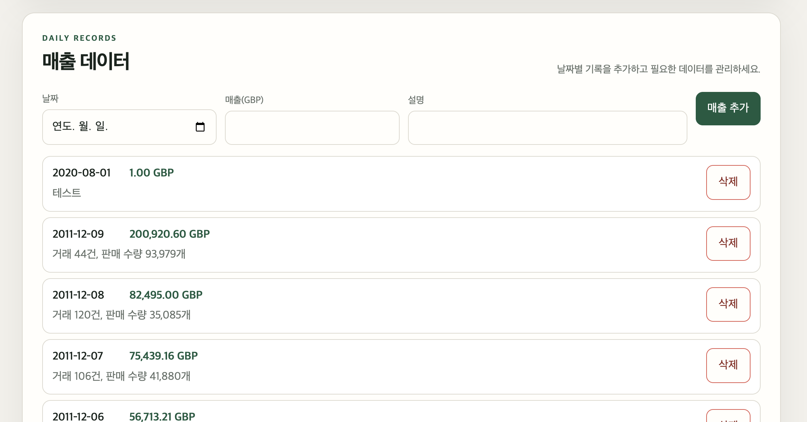

# M1-2 · 온라인 쇼핑몰 매출 분석 AI

영국 온라인 소매 거래 데이터를 일별 매출로 분석하고, 저장된 요약 정보를 바탕으로 질문에 답하는 AI 서비스입니다.

## M1-2는 어떤 과제인가?

M1-2의 핵심은 **데이터를 저장하고 요약하는 웹 서비스에 AI 대화를 연결하고, 그 설계 이유까지 설명하는 것**입니다. 이 프로젝트는 그 주제를 온라인 쇼핑몰의 일별 매출로 정했습니다. 화면만 만드는 것으로 끝나지 않고, 브라우저에서 입력한 값이 API를 거쳐 데이터베이스에 남고, 그 데이터를 근거로 AI가 답하며, 이전 대화까지 다시 불러올 수 있어야 합니다.

매출 합계·평균·증감률은 Python 코드가 계산하고, AI는 계산된 결과를 사람이 이해하기 쉬운 문장으로 설명합니다. 직접 AI 모델을 학습시키거나 미래 매출을 예측하는 기능은 구현하지 않았습니다. 사용하는 데이터는 과거 영국 소매 매출이고 단위는 GBP입니다. 현재 요약은 저장된 일별 매출을 대상으로 하므로, 현재 달 실적이나 월별 최고 실적을 제공하려면 해당 기간의 데이터와 월별 집계 기능이 필요합니다.

예를 들어 사용자가 매출을 추가하면 Firestore에 저장되고 목록과 요약 카드가 갱신됩니다. 이어서 “가장 매출이 높은 날은?”이라고 질문하면 서버가 최신 저장 데이터를 요약해 AI에 전달합니다. 답변이 성공하면 질문과 답변을 함께 저장하므로, 새로고침한 뒤에도 이전 대화 목록에서 다시 볼 수 있습니다.

### 먼저 이해할 개념

| 개념 | 쉬운 설명 | 이 프로젝트에서 맡는 일 |
| --- | --- | --- |
| 프론트엔드와 백엔드 | 사용자가 보는 화면과 요청을 처리하는 서버 | HTML/CSS/JavaScript가 입력·표시를 담당하고 FastAPI가 검증·계산·저장을 담당합니다. |
| HTTP API와 JSON | 화면과 서버가 주고받는 요청 규칙과 데이터 형식 | `GET`은 조회, `POST`는 생성·채팅, `PUT`은 전체 수정, `DELETE`는 삭제에 사용합니다. |
| CRUD | 생성(Create)·조회(Read)·수정(Update)·삭제(Delete) | 매출 API는 네 동작을 제공하고, 매출 화면은 추가·조회·삭제를 제공합니다. |
| FastAPI와 라우터 | Python 웹 API 도구와 URL별 요청 담당자 | `/api/data`, `/api/conversations`, `/api/chat`을 역할에 따라 나눕니다. |
| Pydantic 스키마 | 데이터가 지켜야 할 형식과 제약 | 날짜·금액·질문 길이를 검사하고 응답 형식도 정의합니다. |
| Swagger UI와 OpenAPI | API 사용 설명 화면과 그 설명의 표준 형식 | `/docs`에서 요청·응답 모델을 보고 API를 시험할 수 있습니다. |
| Firestore 컬렉션·문서 | 문서 묶음과 그 안의 개별 저장 단위 | `data`에는 날짜별 매출, `conversations`에는 대화별 메시지를 저장합니다. |
| 서비스와 저장소 | 처리 규칙과 DB 접근을 분리한 코드 | 서비스는 요약·AI 흐름, 저장소는 Firestore 읽기·쓰기를 맡습니다. |
| 의존성 주입 | 필요한 부품을 바깥에서 전달하는 방식 | FastAPI `Depends`로 저장소·AI를 전달하고 테스트에서는 가짜 구현으로 교체합니다. |
| 컨텍스트 주입 | AI가 답할 때 참고할 정보를 요청에 함께 넣는 방식 | 매출 요약을 시스템 프롬프트에 넣어 데이터에 근거한 답변을 유도합니다. |
| 화면 상태 | 현재 화면이 기억하는 값 | 선택한 대화 ID, 전송 중 여부, 매출 목록과 표시 개수를 JavaScript 변수가 기억합니다. |
| 환경변수·CORS·콜드스타트 | 실행 설정·브라우저의 출처 간 접근 정책·서버 첫 기동 지연 | 배포 주소와 인증 설정을 관리하고, 다른 도메인의 API 요청과 첫 접속 대기를 처리합니다. |

### 전체 연결 구조

```text
브라우저: 데이터 관리 / 요약 카드 / 대화 목록 / 채팅
    │ HTTP 요청·JSON 응답
    ▼
FastAPI 라우터 ── Pydantic으로 요청 검증
    ├─ 매출 API ── DataRepository ── Firestore data
    ├─ 요약 API ── build_summary(저장된 매출)
    ├─ 대화 API ── ConversationRepository ── Firestore conversations
    └─ 채팅 API ── 매출 조회 → 같은 build_summary → 시스템 프롬프트
                                              │
                                     이전 대화 + 새 질문
                                              ▼
                                        AI API 호출
                                              │ 성공한 답변
                                              ▼
                              질문·답변 저장 → 화면에 답변·대화 ID 반환
```

브라우저가 Firebase 인증정보나 AI 키를 직접 다루지 않습니다. 백엔드가 외부 서비스에 연결하고, 화면은 이 프로젝트의 API만 호출합니다.

## 소개

온라인 쇼핑몰을 운영하다 보면 "요즘 매출이 늘고 있나?", "어느 날이 제일 잘 팔렸지?" 같은 질문에 답하려고 매번 거래 내역 전체를 열어 직접 훑어봐야 하는 불편이 있습니다. 이 서비스는 그 과정을 대신합니다.

- **매출 요약 화면**: 저장된 날짜별 매출의 기간·건수·총매출·평균·최대/최소·최근 추세(증가·감소·유지)를 한 화면에서 바로 보여줍니다.
- **매출 데이터 관리 화면**: 날짜별 매출을 추가·삭제하며 저장된 목록을 확인할 수 있습니다.
- **AI 채팅**: "최근 매출 추세가 어때?"처럼 자연어로 물으면, 실제 저장된 매출 요약을 근거로 한국어 답을 받습니다. 원본 거래 데이터를 직접 뒤지지 않아도 됩니다.

## 화면 스크린샷

배포된 화면([`https://codyssey-one.vercel.app`](https://codyssey-one.vercel.app))에서 실제로 캡처했습니다.

**매출 요약과 AI 채팅**


데이터 기간·건수·총매출·평균·최대/최소·최근 추세를 요약 카드로 보여주고, 그 아래 채팅에서 "최근 매출 추세가 어때?"라는 질문에 실제 저장된 매출(총매출 10,666,684.60 GBP, 최근 7일 대비 42.5% 증가)을 근거로 답합니다.

**이전 대화 목록과 재조회**


왼쪽 "이전 대화" 목록에서 과거 질문("가장 매출이 잘 나온 때가 언…", "오늘의 매출은?", "최근 매출 추세가 어떻게 돼?")을 선택하면, 오른쪽에 그 대화의 질문("가장 매출이 잘 나온 때가 언제야?")과 AI 답변("가장 매출이 잘 나온 때는 2011-12-09입니다. 이날의 매출은 200,920.60 GBP로, 요약된 데이터 기준 최대 매출입니다.")이 나눴던 순서 그대로 다시 나타납니다. 답변에 쓰인 날짜·금액도 실제 저장된 최댓값과 일치합니다.

**매출 데이터 추가**



날짜·매출·설명을 입력하고 "매출 추가"를 누르면, 서버에 저장된 뒤 날짜 내림차순 목록에 새 항목이 반영됩니다(선택한 매출은 "삭제" 버튼과 확인창으로 지울 수 있습니다).

## 빠른 시작

처음 이 프로젝트를 받은 사람이 자기 컴퓨터에서 실행하는 순서입니다. 각 항목의 자세한 내용은 아래 관련 절을 참고하세요.

1. [환경변수 목록](#환경변수-목록)을 참고해 `.env`를 준비합니다(`.env.example` 복사 후 값 채우기).
2. Python 3.10 이상에서 가상환경을 만들고 [`requirements.txt`](requirements.txt)를 설치합니다.
   ```bash
   python3 -m venv .venv
   source .venv/bin/activate
   pip install -r requirements.txt
   ```
3. [로컬 Firebase 연결](#로컬-firebase-연결) 절대로 서비스 계정을 준비하고 연결을 확인합니다.
4. (원본 데이터를 처음부터 다시 정리하려면) [데이터 전처리](#데이터-전처리) 절의 명령으로 `data/daily_sales.csv`를 만듭니다. 이미 있는 CSV를 그대로 쓰면 생략해도 됩니다.
5. [일별 매출 CSV Firestore 적재](#일별-매출-csv-firestore-적재) 절의 명령으로 Firestore에 매출 데이터를 넣습니다.
6. [AI 연동](#ai-연동코디세이-api-콘솔) 절을 참고해 코디세이 API 키를 설정합니다.
7. [백엔드 실행](#백엔드-실행)과 [프론트엔드 실행](#프론트엔드-실행) 절의 명령으로 두 서버를 각각 켭니다.
8. [자동 테스트](#자동-테스트)로 주요 기능이 정상인지 확인합니다.

## 기술 스택

- **백엔드**: Python 3.12, FastAPI, Uvicorn, Pydantic
- **데이터베이스**: Firebase Firestore (Firebase Admin SDK)
- **AI**: 코디세이 API 콘솔의 OpenAI 호환 엔드포인트, `openai` Python SDK, 모델 `gpt-5.4-mini`
- **프론트엔드**: HTML, CSS, 바닐라 JavaScript (별도 빌드 도구 없음)
- **테스트**: pytest, FastAPI `TestClient`
- **배포**: 백엔드 Render, 프론트엔드 Vercel

## 아키텍처

서버 코드는 역할별로 네 계층으로 나눕니다.

```text
routers/       요청을 받고 상태 코드를 정하는 부분 (FastAPI 엔드포인트)
services/      실제 계산·조합을 하는 부분 (요약 계산, AI 프롬프트, 채팅 흐름)
repositories/  Firestore 문서를 읽고 쓰는 부분
schemas/       요청·응답 데이터 모양 (Pydantic 모델)
```

라우터가 Firestore를 직접 호출하지 않고 저장소(repository)를 거치게 만든 이유는, 테스트할 때 진짜 Firestore 대신 가짜 저장소로 바꿔 끼울 수 있게 하기 위해서입니다. 실제로 `tests/` 아래 모든 테스트는 `app.dependency_overrides`로 저장소와 AI 클라이언트를 가짜로 교체해 실행하며, 비용이나 네트워크 없이도 통과합니다.

요청값은 Pydantic 모델(`backend/schemas/`)로 먼저 검사합니다. 예를 들어 매출 날짜가 실제 존재하는 날짜인지, 매출 금액이 0 이상인지, 질문이 비어 있지 않은지를 라우터 코드에 도달하기 전에 걸러냅니다. 잘못된 입력이 Firestore나 AI 호출까지 가면 디버깅이 어렵고 비용도 낭비되므로, 가능한 한 앞단에서 막습니다. 검증에 실패하면 서버는 요청 검증 실패에 HTTP 422와 함께 같은 형식의 한국어 오류를 돌려줍니다.

## 구현 원리와 설계 이유

### 라우터·서비스·저장소를 왜 나누었나?

라우터는 “어떤 URL 요청을 받아 어떤 응답을 줄 것인가”, 서비스는 “무엇을 계산하고 어떤 순서로 처리할 것인가”, 저장소는 “Firestore에서 어떻게 읽고 쓸 것인가”를 담당합니다. 예를 들어 채팅 라우터는 입력을 받고 예외를 HTTP 오류로 바꾸며, `chat_service.py`는 요약·AI 호출·저장을 연결합니다. 매출 CRUD처럼 별도 계산이 없는 요청은 라우터에서 저장소를 직접 사용합니다. 모든 기능에 형식적으로 서비스 파일을 하나씩 만들지는 않았습니다.

이 구분 덕분에 요약 기준이 바뀌면 계산 코드를, 저장 방식이 바뀌면 저장소를 중심으로 수정할 수 있습니다. 테스트에서는 `dependency_overrides`로 외부 의존성을 바꿔 정상 응답뿐 아니라 AI 실패·없는 문서·중복 날짜도 재현합니다.

근거: [매출 라우터](backend/routers/data.py), [채팅 서비스](backend/services/chat_service.py), [의존성 제공 함수](backend/core/deps.py).

### 데이터와 대화의 저장 구조는 왜 다른가?

`data`는 하루에 하나의 매출 집계라는 규칙이 있어 날짜를 문서 ID로 사용합니다. 일반 추가 API는 같은 날짜가 있으면 409를 반환하고, CSV 적재는 같은 ID를 덮어써 재실행 시 중복 문서를 만들지 않습니다. 두 동작은 의도적으로 다릅니다.

`conversations`는 같은 제목의 대화도 여러 개 생길 수 있으므로 자동 ID를 사용합니다. 제목은 목록용이고, 실제 식별은 ID로 합니다. 메시지를 배열로 묶으면 대화 한 건을 읽어 질문과 답변을 순서대로 복원하기 쉽습니다. 목록 API는 본문을 제외한 ID·제목·시각을 반환하고 최근 수정 순으로 정렬합니다. 다만 현재 저장소는 문서 전체를 읽은 뒤 필요한 필드만 반환하므로 DB 읽기 자체까지 가벼워지는 것은 아닙니다.

배열 방식은 긴 대화를 계속 덮어써야 하는 단점이 있습니다. 현재 누적 저장은 읽기 후 배열을 합쳐 쓰므로 동시 요청 때 덮어쓰기 충돌도 가능합니다. 대화가 커지면 메시지 하위 컬렉션과 페이지 조회, 트랜잭션 또는 동시성 제어를 검토할 수 있습니다. 이는 향후 개선 방향입니다.

### 요청·응답 스키마와 검증은 어디에 적용했나?

입력 모델은 사용자가 보낼 수 있는 필드만, 응답 모델은 화면에 필요한 ID·시각·계산 결과까지 포함하도록 나눴습니다. 공통 `ApiModel`은 앞뒤 공백을 제거하고 정의하지 않은 필드를 거절합니다.

| 대상 | 현재 검증 규칙 | 목적 |
| --- | --- | --- |
| 매출 생성·수정 | 실제 날짜, 0 이상인 유한한 금액, 설명 1~500자 | 잘못된 값이 저장·집계되는 것을 방지 |
| 채팅 요청 | 질문 1~1,000자, 선택 대화 ID 1~128자 | 빈 질문과 과도한 입력을 제한 |
| 대화 메시지 | `user`/`assistant` 역할, 내용 1~4,000자, 시각 형식 | 저장·조회 시 사용할 메시지 구조를 일정하게 유지 |
| 대화 생성·상세 응답 | 메시지 최대 200개 | 모델이 허용하는 대화 크기 명시 |
| 요약 응답 | 수치·날짜 타입, 자료 부족 시 `null`, 정해진 추세 문자열 | 화면과 AI가 같은 의미로 결과를 해석 |

FastAPI가 라우터에 전달하기 전에 요청 본문을 검사하고, 라우터의 `response_model` 및 `model_validate`가 반환 데이터의 형식도 검사합니다. 입력 검증 실패는 `422`와 `{"error":{"code":"VALIDATION_ERROR","message":"요청값을 확인해 주세요."}}`로 응답합니다. 값의 형식이 맞는다고 매출의 진실성까지 증명되지는 않습니다. 예를 들어 매우 큰 양수도 현재 금액 규칙에는 맞으므로 업무 기준의 상한·승인·감사는 별도 과제입니다.

근거: [스키마](backend/schemas/data.py), [공통 스키마](backend/schemas/base.py), [오류 응답 처리](backend/main.py).

### 요약 API는 무엇을 계산하나?

`GET /api/data/summary`는 저장된 일별 매출 전체를 날짜순으로 정렬해 다음 값을 만듭니다. AI가 합계를 계산하는 것이 아니라 [build_summary](backend/services/summary_service.py)가 계산합니다.

| 결과 | 계산 의미 |
| --- | --- |
| 기간·건수 | 가장 이른 날짜, 가장 늦은 날짜, 저장된 일별 문서 수 |
| 총매출·평균 | 모든 `value`의 합, 그 합을 문서 수로 나눈 값 |
| 최대·최소 | 가장 큰 값과 가장 작은 값 및 해당 날짜. 동률이면 정렬상 먼저인 날짜 |
| 최근·이전 평균 | 날짜순 마지막 7개 기록 평균과 그 직전 7개 기록 평균 |
| 증감률 | `(최근 평균 - 이전 평균) / 이전 평균 × 100` |
| 추세 | 증감률의 부호에 따라 증가·감소·유지, 14개 미만이면 자료 부족 |

**필드와 화면에는 “7일”이라고 표시하지만 실제 구현은 달력상 7일이 아니라 기록 7개 기준입니다.** 누락된 날짜는 0으로 채우지 않으며, 전체 평균도 달력 일수가 아닌 저장 문서 수로 나눕니다. 예를 들어 이전 7개 평균이 100이고 최근 7개 평균이 120이면 20% 증가입니다. 이전 평균이 0이고 최근 값이 양수이면 증가로 표시하되 증감률은 `null`로 반환합니다. 둘 다 0이면 0%·유지입니다. 데이터가 없으면 건수·합계·평균은 0, 날짜·최대·최소 등은 `null`입니다.

요약을 별도 API로 둔 이유는 채팅 없이도 화면에서 수치를 보여주고 계산 규칙을 따로 검증하기 위해서입니다. 채팅 서버가 `/api/data/summary`를 HTTP로 다시 호출하는 구조는 아닙니다. 요약 라우터와 채팅 서비스가 **동일한 `build_summary` 함수**를 호출합니다. 덕분에 계산 기준을 한곳에서 관리할 수 있습니다.

### 컨텍스트 주입은 어떻게 동작하고, 어떤 한계가 있나?

시스템 프롬프트는 AI의 역할과 답변 기준을 전달하는 메시지입니다. [ai_prompt.py](backend/services/ai_prompt.py)는 매출 기간·건수·총매출·평균·최대·최소·추세를 문장으로 만들고 “요약을 근거로 한국어로 답하고, 알 수 없는 내용은 추측하지 말라”는 지침을 붙입니다. AI 요청에는 이 시스템 메시지, 기존 대화가 있으면 이전 메시지, 새 질문을 함께 보냅니다.

이 방식은 AI가 원래 알 수 없는 우리 DB의 최신 요약을 참고하도록 합니다. 원본 거래 전체를 보내는 것보다 입력량이 작고, 숫자 계산을 코드로 고정할 수 있습니다. 모델 재학습이나 벡터 검색을 구현한 것은 아닙니다.

대신 요약에 없는 상품별·국가별 매출, 특정 달 합계, 매출 변화의 원인은 정확히 답할 근거가 없습니다. 과거 데이터만 있는데 “오늘 매출”을 물어도 오늘 값을 만들어 내면 안 됩니다. 시스템 지침이 환각이나 프롬프트 인젝션을 완전히 막지는 않으므로 답변의 수치는 요약 응답과 대조해야 합니다. 저장된 과거 답변은 당시의 기록이고, 이어서 질문할 때는 현재 DB로 요약을 다시 계산합니다.

### 대화는 언제 저장하고 어떻게 이어가나?

새 채팅은 `conversation_id: null`로 요청합니다. AI 답변을 받은 뒤 질문·답변 두 메시지를 함께 새 문서로 저장하고 ID를 반환합니다. 첫 질문의 앞부분으로 제목을 만들며, 이후 질문은 그 ID를 보내 기존 메시지 뒤에 새 질문·답변을 붙입니다.

AI 호출이 실패하면 질문만 있는 대화를 DB에 남기지 않습니다. 화면에는 먼저 표시한 질문과 실패 안내가 보일 수 있지만 저장된 대화와는 구분해야 합니다. 또한 AI 성공 후 DB 저장이 실패하거나, 화면이 시간 초과된 뒤 서버가 저장을 마치는 경우까지 중복 없이 처리하는 장치는 아직 없습니다. 재시도 중복 방지를 강화하려면 요청 ID를 통한 멱등성 처리가 필요합니다.

일반 채팅 화면은 `POST /api/chat`의 자동 저장을 사용합니다. 별도 `POST /api/conversations`는 메시지를 직접 저장하는 API이며, 화면에서 답변마다 이 API를 추가 호출하는 구조는 아닙니다.

### 화면들은 어떤 상태 흐름으로 연결되나?

| 사용자 동작 | 화면의 상태와 API 흐름 |
| --- | --- |
| 첫 접속 | `app.js`가 `/health` 성공 후 데이터·요약·대화 목록 모듈을 초기화합니다. `/health` 성공만으로 DB·AI 연결 성공까지 확인되지는 않습니다. |
| 매출 추가·삭제 | 서버 저장 성공 후 `data.js`의 `refreshAll()`이 목록과 요약을 함께 재조회합니다. 목록은 날짜 내림차순이며 새 기록의 위치는 날짜에 따라 달라집니다. |
| 목록 더 보기 | `allRecords`는 전체 기록, `visibleCount`는 표시 개수입니다. 처음 20개에서 20개씩 늘립니다. 서버 페이지 조회는 아닙니다. |
| 질문 보내기 | `isSending`으로 중복 전송을 막고 입력·전송 버튼을 비활성화합니다. 답변 성공 시 `currentConversationId`를 저장하고 대화 목록을 갱신합니다. |
| 이전 대화 불러오기 | 상세 API로 받은 `messages`를 순서대로 표시하고 선택 ID를 바꿉니다. 다음 질문에는 이 ID가 들어가 같은 대화를 이어갑니다. |
| 새 대화 | 선택 ID를 `null`로 하고 화면을 비웁니다. 기존 DB 대화는 삭제하지 않습니다. |
| 오류·대기 | 공통 배너·채팅 로딩 표시·오류 문구를 보여주고, 전송이 끝나면 입력을 다시 활성화합니다. |

근거: [화면 초기화](frontend/js/app.js), [데이터 화면](frontend/js/data.js), [채팅 화면](frontend/js/chat.js).

### 콜드스타트와 CORS를 어떻게 설명할 수 있나?

콜드스타트는 잠들어 있던 서버가 첫 요청을 처리하기 위해 준비되는 지연입니다. 화면에는 첫 접속 지연 안내와 연결 중 배너가 있고, 연결 실패 시 “다시 시도” 버튼을 제공합니다. [api.js](frontend/js/api.js)의 요청 제한은 15초이므로 안내 문구의 1분을 자동으로 기다리는 구현은 아닙니다. 또한 AI 클라이언트의 기본 제한은 20초로 화면보다 길어, 화면은 실패로 보여도 서버 처리가 이어질 수 있습니다. 시간 제한 정렬과 제한된 자동 재시도는 개선할 수 있는 부분입니다.

CORS는 프론트와 백엔드의 출처가 다를 때 브라우저가 응답 접근을 제한하는 정책입니다. 로컬의 `localhost:3000`과 `localhost:8000`도 포트가 달라 다른 출처이며, Vercel과 Render도 도메인이 다릅니다. 백엔드 `ALLOWED_ORIGINS`에 실제 프론트 출처를 등록하면 `CORSMiddleware`가 필요한 허용 헤더와 사전 요청 처리를 제공합니다. 허용 목록이 실제 접속 주소와 다르면 브라우저에서 API 응답을 읽지 못할 수 있습니다. 배포 도메인이 바뀌면 Render의 환경변수에도 새 출처를 반영해야 합니다.

### 사용자 입력의 위험과 현재 대응은 무엇인가?

매출 설명이나 대화에 HTML·스크립트를 입력하면 화면에서 실행되는 XSS 위험이 있습니다. 채팅 본문은 `textContent`로 표시하고, HTML 문자열로 만드는 목록의 사용자 값은 `escapeHtml`을 거칩니다. 이는 출력 시 HTML 실행을 막기 위한 처리이며 원문을 DB에서 삭제하는 필터는 아닙니다.

데이터 오염은 Pydantic의 날짜·금액·길이 검증으로 일부 제한합니다. AI 지시를 바꾸려는 입력에는 시스템 프롬프트로 답변 범위를 안내하지만 전용 탐지·차단 필터는 없습니다. 매출 `memo`는 현재 요약 프롬프트에 넣지 않지만 사용자 질문과 이전 대화는 AI에 전달됩니다. 로그인·권한 검사·요청 횟수 제한도 없으므로 입력 검증과 CORS만으로 무단 데이터 변경이나 비용 남용을 막을 수 있다고 설명해서는 안 됩니다.

### 데이터가 늘거나 “최근 30일”로 기준이 바뀌면?

현재는 매출 전체를 읽어 Python에서 정렬·요약합니다. 데이터가 커지면 날짜 범위 조회·서버 페이지 조회를 저장소에 추가하고, 반복 계산을 줄일 집계 문서나 캐시를 검토할 수 있습니다. 대화 목록도 현재는 모든 대화 문서를 읽으므로 같은 개선 대상입니다.

“최근 30일”은 먼저 오늘 기준인지 데이터 마지막 날짜 기준인지 정해야 합니다. 현재 데이터는 과거 자료이므로 오늘 기준이면 결과가 없을 수 있습니다. 기준일과 시작일로 날짜를 필터링하도록 저장소·요약 흐름을 바꾸고, 날짜가 없는 날을 제외할지 0으로 채울지도 정해야 합니다. 상수 7을 30으로 바꾸기만 하면 최근 30개 기록이 되어 요구와 다를 수 있습니다.

변경 지점은 `summary_service.py`의 계산 규칙, 필요하면 `data_repository.py`의 범위 조회, `SummaryResponse`의 필드명·설명, `ai_prompt.py`의 문구, `summary.js`의 표시, `test_summary_service.py`의 경계 조건입니다. 요약 화면과 채팅이 같은 함수를 사용하므로 공통 계산 변경을 함께 반영할 수 있습니다. 이 절은 확장 방법을 설명하며 현재 30일 필터나 캐시가 구현되었다는 뜻은 아닙니다.

### 작은 화면에서는 어떻게 배치되나?

[styles.css](frontend/css/styles.css)는 좁은 화면에서 입력 폼과 대화 영역을 세로로 배치합니다. 화면 너비가 640px 이상이면 폼과 대화 목록·채팅을 가로로 배치하고, 900px 이상이면 헤더 배치를 조정합니다. 같은 HTML과 기능을 유지하면서 화면 폭에 따라 배치만 바꾸는 반응형 구성입니다.

데이터 입력·추가·삭제, 대화 선택과 질문 전송은 화면 크기와 관계없이 같은 API를 사용합니다. 작은 화면에서의 사용성은 가로 스크롤이나 입력 영역 잘림 없이 이 동작들을 수행할 수 있는지로 확인할 수 있습니다.

## API 목록

모든 `/api` 응답은 JSON이며 삭제 성공은 본문 없는 204입니다. 구체 필드와 시험 입력은 Swagger UI에서 확인할 수 있습니다.

| 메서드·경로 | 역할 |
| --- | --- |
| `GET /health` | 서버 프로세스 응답 확인 |
| `POST /api/data` | 매출 생성, 성공 201·중복 날짜 409 |
| `GET /api/data` | 전체 매출 조회 |
| `GET /api/data/summary` | 매출 요약 조회 |
| `GET /api/data/{data_id}` | 날짜 ID로 매출 단건 조회 |
| `PUT /api/data/{data_id}` | 날짜·금액·설명을 보내 전체 수정, 날짜 변경은 409 |
| `DELETE /api/data/{data_id}` | 매출 삭제 |
| `POST /api/chat` | 질문 처리·AI 답변·대화 자동 저장 |
| `POST /api/conversations` | 전달한 대화 메시지를 별도로 저장, 성공 201 |
| `GET /api/conversations` | 대화 제목·ID·시각 목록 조회 |
| `GET /api/conversations/{conversation_id}` | 메시지를 포함한 대화 상세 조회 |
| `DELETE /api/conversations/{conversation_id}` | 대화 삭제 |

존재하지 않는 문서는 404, 잘못된 입력은 422, AI 서비스 오류는 502로 안내합니다. 예상하지 못한 서버 오류는 내부 정보를 노출하지 않는 공통 500 메시지로 응답합니다.

## 학습 노트

- [Firebase 프로젝트와 Firestore 준비 (3-1~3-17)](docs/learning-note-stage-3-firestore.md)

## 데이터 출처

- 데이터셋: [UCI Machine Learning Repository — Online Retail](https://archive.ics.uci.edu/dataset/352/online+retail)
- 인용: Chen, D. (2015). *Online Retail* [Dataset]. UCI Machine Learning Repository.
- DOI: [10.24432/C5BW33](https://doi.org/10.24432/C5BW33)
- 라이선스: [CC BY 4.0](https://creativecommons.org/licenses/by/4.0/)
- 거래 기간: 2010-12-01 ~ 2011-12-09
- 규모: 541,909개 거래 행
- 업체 정보: 영국에 등록된 비점포 온라인 소매업체이며, 업체명은 공개되지 않았습니다.
- 고객 정보: 고객은 이름 대신 숫자형 `CustomerID`로 구분됩니다.

원본 파일은 `data/Online Retail.xlsx`에 로컬로 보관하며, 용량과 재배포 관리를 위해 Git 추적 대상에서 제외합니다.

### 확인한 원본 필드

| 필드 | 의미 |
| --- | --- |
| `InvoiceNo` | 거래 송장 번호 |
| `Description` | 상품 설명 |
| `Quantity` | 거래별 상품 수량 |
| `InvoiceDate` | 거래 생성 날짜와 시간 |
| `UnitPrice` | 상품 한 개당 가격(파운드) |
| `Country` | 고객 거주 국가 |

원본에는 위 필드 외에도 `StockCode`, `CustomerID`가 포함되어 있습니다.

## 데이터 전처리

다음 기준으로 원본 거래를 정제합니다.

1. `InvoiceNo`가 `C`로 시작하는 취소 거래를 제외합니다.
2. `Quantity`가 0 이하인 반품·비정상 거래를 제외합니다.
3. `UnitPrice`가 0 이하인 무료·비정상 거래를 제외합니다.
4. `InvoiceNo`, `Description`, `Quantity`, `InvoiceDate`, `UnitPrice`, `Country` 중 하나라도 비어 있는 행을 제외합니다.
5. 거래별 매출을 `Quantity × UnitPrice`로 계산하고 거래 날짜별로 합산합니다.
6. 날짜별 고유 송장 수와 판매 수량 합계를 `memo`에 기록합니다.

원본 파일은 수정하지 않으며 다음 명령으로 `data/daily_sales.csv`를 다시 만들 수 있습니다.

```bash
source .venv/bin/activate
python scripts/preprocess_sales.py
```

결과는 Firestore 적재에 사용할 `date`, `value`, `memo` 세 열로 구성됩니다. `value`는 영국 파운드(GBP) 기준이며 소수점 둘째 자리로 반올림합니다.

## Firestore 데이터 구조

Firebase 프로젝트 `codyssey-m1-2-e3344`의 `(default)` Firestore Database를 사용합니다. 데이터베이스는 Standard 버전, 프로덕션 모드이며 위치는 `asia-northeast3`(Seoul)입니다.

### `data` 컬렉션

하루의 매출 집계를 문서 한 건으로 저장합니다. 같은 날짜를 다시 적재해도 문서가 중복 생성되지 않도록 문서 ID는 `date`와 동일한 `YYYY-MM-DD` 형식을 사용합니다.

| 필드 | Firestore 타입 | 필수 | 의미 및 예시 |
| --- | --- | --- | --- |
| `date` | string | 예 | 집계 날짜, ISO 8601 `YYYY-MM-DD` 형식. 예: `2010-12-01` |
| `value` | number | 예 | 해당 날짜의 총매출(GBP), 0 이상의 숫자. 예: `58635.56` |
| `memo` | string | 예 | 거래 건수와 판매 수량 요약. 예: `거래 127건, 판매 수량 2,685개` |
| `created_at` | timestamp | 예 | 문서를 처음 생성한 서버 시각 |
| `updated_at` | timestamp | 예 | 문서를 마지막으로 수정한 서버 시각 |

```json
{
  "date": "2010-12-01",
  "value": 58635.56,
  "memo": "거래 127건, 판매 수량 2,685개",
  "created_at": "<server timestamp>",
  "updated_at": "<server timestamp>"
}
```

### `conversations` 컬렉션

AI 채팅 한 대화를 문서 한 건으로 저장하며 문서 ID는 Firestore 자동 ID를 사용합니다. `messages` 배열의 순서가 실제 대화 순서입니다.

| 필드 | Firestore 타입 | 필수 | 의미 및 예시 |
| --- | --- | --- | --- |
| `title` | string | 예 | 대화 목록에 표시할 제목. 첫 사용자 질문을 기준으로 생성 |
| `messages` | array&lt;map&gt; | 예 | 사용자와 AI 메시지를 시간순으로 저장한 배열 |
| `created_at` | timestamp | 예 | 대화를 처음 생성한 서버 시각 |
| `updated_at` | timestamp | 예 | 메시지를 마지막으로 추가하거나 대화를 수정한 서버 시각 |

`messages`의 각 원소는 다음 필드를 가집니다.

| 필드 | Firestore 타입 | 의미 |
| --- | --- | --- |
| `role` | string | 메시지 작성자. `user` 또는 `assistant`만 허용 |
| `content` | string | 사용자 질문 또는 AI 답변 |
| `created_at` | timestamp | 메시지를 생성한 서버 시각 |

```json
{
  "title": "최근 매출 추세가 어때?",
  "messages": [
    {
      "role": "user",
      "content": "최근 매출 추세가 어때?",
      "created_at": "<server timestamp>"
    },
    {
      "role": "assistant",
      "content": "최근 7일 평균을 이전 7일과 비교하면…",
      "created_at": "<server timestamp>"
    }
  ],
  "created_at": "<server timestamp>",
  "updated_at": "<server timestamp>"
}
```

대화 문서와 매출 문서의 생성·수정 시각은 백엔드의 UTC 시각(`datetime.now(timezone.utc)`)으로 기록합니다. Firestore의 서버 타임스탬프 센티널을 쓰는 구현은 아닙니다. 채팅 API의 메시지 시각도 백엔드에서 생성하지만, 별도 대화 생성 API는 요청에 포함된 메시지 시각을 받습니다. 실제 컬렉션과 문서는 초기 데이터 적재 및 API 호출 시 생성합니다. CSV 재적재는 `created_at`도 다시 기록합니다.

## 일별 매출 CSV Firestore 적재

`data/daily_sales.csv`를 `data` 컬렉션에 배치로 적재합니다. 문서 ID를 `date`로 고정하므로 같은 명령을 다시 실행해도 문서가 중복되지 않고 값만 덮어씁니다.

```bash
source .venv/bin/activate
python -m scripts.load_sales_to_firestore
```

실행하면 읽은 건수와 저장 성공·실패 건수를 출력합니다. 적재 후 `GET /api/data`로 실제 저장 건수를 다시 확인할 수 있습니다.

## 로컬 Firebase 연결

서비스 계정 JSON은 프로젝트 밖에 보관하고 로컬 `.env`에는 파일 경로만 설정합니다. 실제 경로와 JSON 내용은 Git에 포함하지 않습니다.

```dotenv
FIREBASE_SERVICE_ACCOUNT_JSON=
FIREBASE_SERVICE_ACCOUNT_PATH=/absolute/path/to/firebase-service-account.json
```

환경을 준비하고 실제 Firestore 연결을 확인합니다.

```bash
source .venv/bin/activate
python -m scripts.check_firestore_connection
```

성공하면 `Firestore 연결에 성공했습니다.`가 출력됩니다. 초기화 코드는 `backend/core/firebase.py`, 환경변수 검증은 `backend/core/config.py`에 있습니다.

## AI 연동(코디세이 API 콘솔)

AI 답변은 OpenAI를 직접 호출하지 않고, 코디세이 API 콘솔이 제공하는 OpenAI 호환 엔드포인트(`https://copa.codyssey.kr/v1`)로 보냅니다. 콘솔에서 발급한 virtual key를 `OPENAI_API_KEY`에 설정하고, 모델은 `gpt-5.4-mini`를 기본값으로 사용합니다.

```dotenv
OPENAI_API_KEY=<코디세이 콘솔에서 발급한 virtual key>
OPENAI_BASE_URL=https://copa.codyssey.kr/v1
OPENAI_MODEL=gpt-5.4-mini
OPENAI_MAX_OUTPUT_TOKENS=500
OPENAI_TIMEOUT_SECONDS=20
```

`OPENAI_BASE_URL`과 `OPENAI_MODEL`을 비워 두면 위 기본값을 그대로 사용합니다. 매출 요약을 시스템 프롬프트로 바꾸는 코드는 `backend/services/ai_prompt.py`, 실제 호출과 오류 처리는 `backend/services/ai_client.py`에 있습니다.

개발·테스트에서는 실제 API를 호출하지 않고 정해진 답을 돌려주는 가짜 AI를 켤 수 있습니다. `ENVIRONMENT=production`이면 이 설정은 무시되고 항상 실제 AI를 호출합니다.

```dotenv
USE_MOCK_AI=true
ENVIRONMENT=development
```

`POST /api/chat` 하나가 처리되는 순서는 다음과 같습니다.

```text
사용자 질문
  → Firestore에서 매출 데이터 조회 및 요약 계산 (`build_summary` 재사용)
  → 요약을 시스템 프롬프트에 넣기 (원본 거래 전체가 아니라 계산된 요약만 전달)
  → 코디세이 API(OpenAI 호환)에 질문 + 요약 전달
  → 사용자 질문과 AI 답변을 conversations 컬렉션에 자동 저장
  → AI 답변과 conversation_id를 화면에 반환
```

실제 OpenAI 호출에는 코디세이 콘솔의 토큰이 소모되어 비용이 생길 수 있습니다. 한 번에 너무 긴 답변이 나오지 않도록 `OPENAI_MAX_OUTPUT_TOKENS`로 최대 답변 길이를 제한하고 있으며, 개발 중에는 위의 `USE_MOCK_AI`로 비용 없이 채팅 흐름만 확인할 수 있습니다.

## 백엔드 실행

```bash
source .venv/bin/activate
uvicorn backend.main:app --reload
```

주요 주소는 다음과 같습니다.

- 상태 확인: `http://localhost:8000/health`
- API 진입점: `http://localhost:8000/api`
- Swagger UI: `http://localhost:8000/docs`
- OpenAPI JSON: `http://localhost:8000/openapi.json`

`ALLOWED_ORIGINS`는 브라우저가 다른 출처의 API 응답을 읽도록 허용할 화면 주소 목록입니다. 서버 시작 시 `backend/core/config.py`가 읽고 `backend/main.py`의 `CORSMiddleware`에 적용합니다. 예를 들어 배포 화면을 허용하려면 `https://codyssey-one.vercel.app`처럼 경로 없는 출처를 설정합니다. CORS는 인증이나 API 직접 호출 차단을 대신하지 않습니다.

백엔드의 비밀값과 실행 설정은 로컬 환경파일 또는 Render 환경변수로 전달합니다. 프론트엔드는 정적 JavaScript이므로 Vercel 환경변수나 백엔드의 `API_BASE_URL`을 자동으로 읽지 않습니다. 실제 API 주소는 `frontend/js/config.js`의 상수와 브라우저 `localStorage` 설정으로 결정됩니다.

## 프론트엔드 실행

프론트엔드는 정적 파일이라 별도 빌드 없이 아무 정적 서버로 열면 됩니다.

```bash
cd frontend
python3 -m http.server 3000
```

브라우저에서 `http://localhost:3000`으로 접속합니다. `frontend/js/config.js`가 접속 주소를 보고 API 서버를 자동으로 고릅니다.

- `localhost`/`127.0.0.1`에서 열면 로컬 백엔드(`http://localhost:8000`)를 사용합니다.
- 그 외 주소(Vercel 배포 등)에서는 배포된 Render 주소를 사용합니다.
- 브라우저 콘솔에서 `localStorage.setItem('apiBaseUrl', '원하는 주소')`로 강제로 바꿀 수도 있습니다.

로컬 프론트엔드(`http://localhost:3000`)에서 배포된 Render 서버로 요청하려면, Render의 `ALLOWED_ORIGINS`에 `http://localhost:3000`이 포함되어 있어야 합니다(기본값에 이미 포함).

## 자동 테스트

```bash
pytest -q
```

실제 Firebase·OpenAI 없이 가짜 저장소와 가짜 AI로 백엔드 전체 기능(스키마 검증, 매출 CRUD, 요약 계산, 대화 CRUD, 채팅 흐름)을 확인합니다.

## 환경변수 목록

실행에 필요한 설정값입니다. 실제 값은 `.env.example`을 복사한 `.env`에만 넣고, Git에는 올리지 않습니다.

| 이름 | 필수 여부 | 의미 |
| --- | --- | --- |
| `OPENAI_API_KEY` | 필수(AI 사용 시) | 코디세이 콘솔에서 발급한 virtual key |
| `OPENAI_BASE_URL` | 선택 | 기본값 `https://copa.codyssey.kr/v1` |
| `OPENAI_MODEL` | 선택 | 기본값 `gpt-5.4-mini` |
| `OPENAI_MAX_OUTPUT_TOKENS` | 선택 | AI 답변 최대 길이(토큰), 기본값 500 |
| `OPENAI_TIMEOUT_SECONDS` | 선택 | AI 응답 대기 제한(초), 기본값 20 |
| `USE_MOCK_AI` | 선택 | `true`면 개발용 가짜 AI 사용 (운영 환경에서는 무시됨) |
| `ENVIRONMENT` | 선택 | `production`이면 `USE_MOCK_AI`를 무시하고 항상 실제 AI 호출 |
| `FIREBASE_SERVICE_ACCOUNT_JSON` | 필수(둘 중 하나) | Firebase 서비스 계정 JSON 문자열 |
| `FIREBASE_SERVICE_ACCOUNT_PATH` | 필수(둘 중 하나) | Firebase 서비스 계정 JSON 파일 경로 |
| `ALLOWED_ORIGINS` | 필수 | CORS를 허용할 프론트엔드 주소 목록(쉼표 구분) |
| `API_BASE_URL` | 참고용 | 프론트엔드 배포 시 참고하는 백엔드 주소 표기 |

`FIREBASE_SERVICE_ACCOUNT_JSON`과 `FIREBASE_SERVICE_ACCOUNT_PATH`는 둘 중 하나만 설정합니다.

## 배포 주소

- 사용자 화면(Vercel): <https://codyssey-one.vercel.app>
- API 서버(Render): <https://codyssey-xmy5.onrender.com>
- API 시험 화면(Swagger): <https://codyssey-xmy5.onrender.com/docs>

프론트엔드는 무료 서버의 첫 기동 지연에 대비해 “첫 요청에 최대 1분 정도 걸릴 수 있다”는 안내를 표시합니다. 이는 화면의 안내 문구이며 응답 시간 보장은 아닙니다. 실제 요청 대기 제한과 재시도 동작은 아래에서 설명합니다.

## 알려진 제한 사항

- 로그인·권한 구분이 없습니다. 화면에 접속할 수 있으면 누구나 매출을 추가·삭제할 수 있습니다.
- 매출 수정은 `PUT /api/data/{data_id}`에서 제공하며 별도 수정 화면은 없습니다. 날짜는 문서 ID여서 수정할 수 없고, 날짜 변경은 삭제 후 새로 추가해야 합니다.
- 매출 목록의 "더 보기"는 서버가 아니라 화면에서 처리합니다. 한 번에 전체 매출을 가져온 뒤 20건씩 나눠 보여주는 방식이라, 매출 건수가 매우 많아지면 초기 로딩이 느려질 수 있습니다.
- 대화 생성·상세 응답 스키마에는 메시지 200개 제한이 있지만, 채팅 누적 저장은 저장 전에 이 상한을 검사하지 않습니다. 대화가 길어지면 상세 조회 검증 실패나 AI 입력 길이 문제가 생길 수 있습니다. 전체 대화 개수 제한도 없습니다.
- 배포 후 자동 통합 테스트(CI)는 구성하지 않았습니다. 가짜 구현을 사용하는 테스트 통과만으로 실제 배포·Firestore 인증·AI 연결 성공까지 보장하지는 않습니다.
